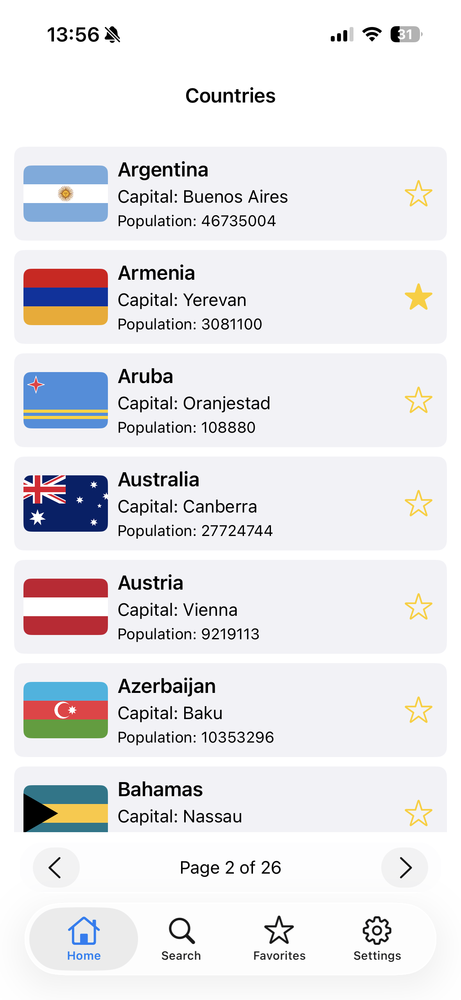
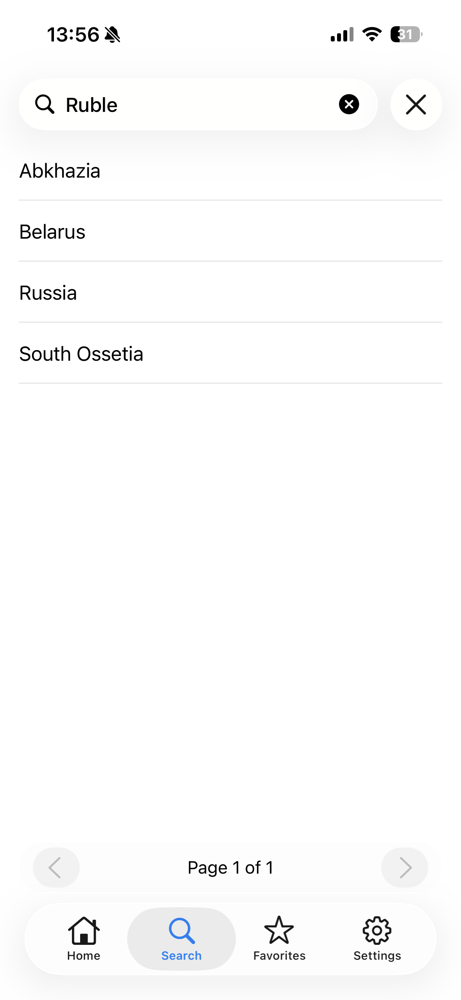
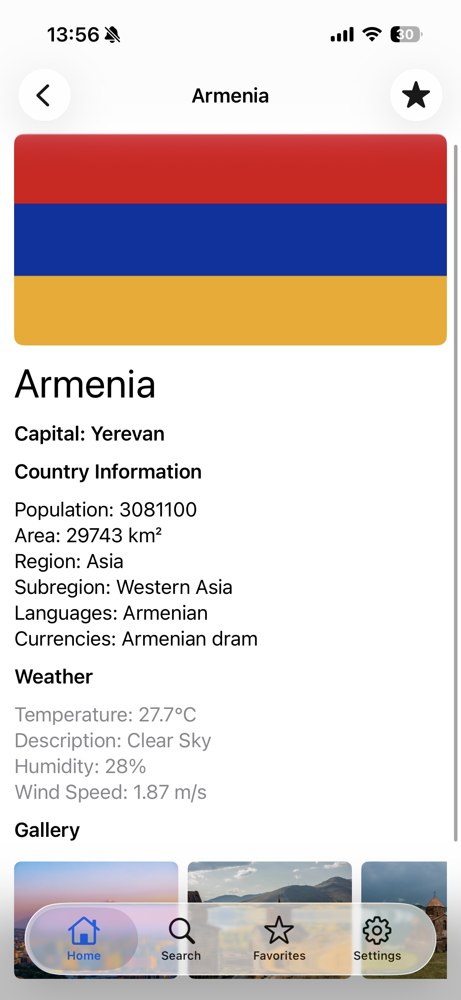

# HSETravel

Приложение для путешествий, которое показывает информацию о странах, погоде, фотографиях и избранных местах.

## Основной функционал

- Поиск стран
- Просмотр подробной информации о выбранной стране
- Отображение текущей погоды через OpenWeather API
- Загрузка фотографий страны через Unsplash API
- Добавление стран в избранное
- Экран "Избранное" для быстрого доступа к сохранённым странам
- Настройки приложения

## Архитектура

HSETravel построено по принципам:

- MVVM — разделение экрана и логики представления
- Coordinator — управление навигацией вне `UIViewController`
- Dependency Injection — контейнер для репозиториев и сервисов
- Репозитории — абстракция работы с API и локальными данными
- Слой сети (`APIClient`, `Endpoint`, `NetworkError`) — централизованная конфигурация запросов
- Core Data / Persistence — хранение избранных стран и состояние приложения

## Основные фишки

- Гибкая навигация через `AppCoordinator`
- Лёгкая тестируемость благодаря `ViewModel` и репозиториям
- Централизованная загрузка изображений и кеширование
- Поддержка нескольких API: OpenWeather и Unsplash
- Удобный экран избранного с сохранением данных между запусками

## Структура проекта

- `AppDelegate.swift`, `SceneDelegate.swift` — запуск и конфигурация приложения
- `Coordinators/` — навигация между экранами
- `DI/` — контейнер зависимостей
- `Models/` — модели данных (`Country`, `Photo`, `Weather`)
- `Network/` — сеть (`APIClient`, `Endpoint`, `NetworkError`)
- `Persistence/` — локальное хранение и избранное
- `Repositories/` — работа с API и данными
- `Services/` — вспомогательные сервисы (`ImageLoader`, логгер)
- `ViewControllers/` — экраны приложения
- `ViewModels/` — логика представления
- `Views/` — пользовательские элементы интерфейса

## Скриншоты

## Примечания

- Если используете `.env` для ключей API, убедитесь, что секреты не попадают в репозиторий.
